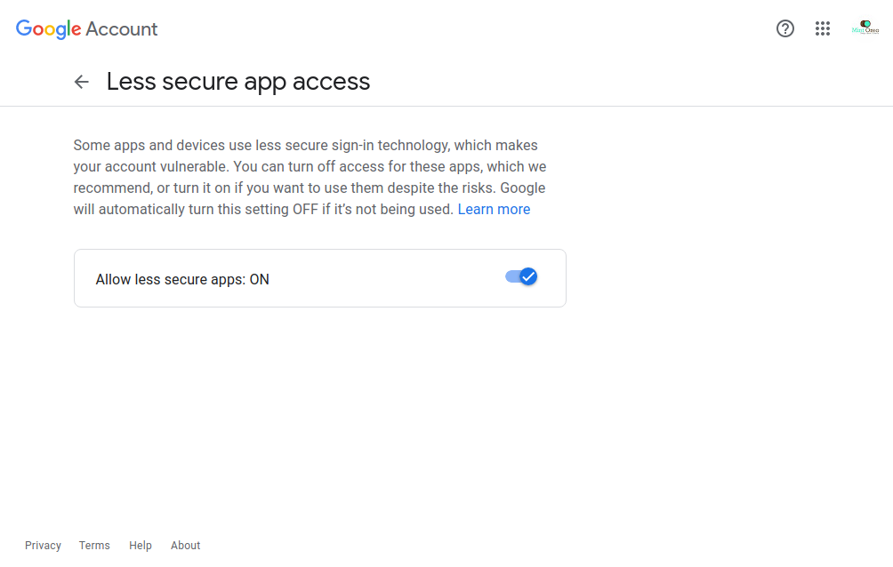

# E-Mail Sender
<p> using NodeJS</p>

### Hacktoberfest 2021

## Important:

For Security Purposes, We can nnot provide email. This NodeJS app is a tested app. In order to use it you need to REPLACE ``` user: 'yourMail@gmail.com', pass: 'YourREALPassword' ```  in <strong>app.js</strong> file.

**Note: If You're Using GMAIL, you will need to turn ON `LESS SECURE APPS` under settings.
Like this


#### How To Use It.
1. Fork into Repository & clone it using `git clone https://github.com/Harshal0902/Hacktoberfest.git`
2. Open `email-sender` folder under NodeJS.
3. Replace your email id & password in `app.js` file as mentioned aboved.
4. Run command `node app.js`
5. Open web browser and goto `localhost:3000`
6. Feedbacks/Improvement are welcomed.